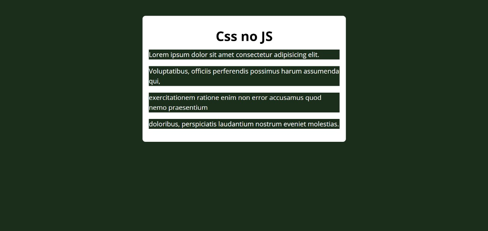

# 🎨 CSS via JavaScript

## 📌 Descrição
Exercício de **JavaScript** onde os estilos da página são aplicados **dinamicamente via código JS**, complementando a base visual definida por um arquivo CSS externo.  
Ao carregar a página, o script define cores, tamanhos, margens e outros estilos diretamente nos elementos criados.

> Este exercício reforça o uso de `element.style` e manipulação visual com JavaScript puro, sobre uma estrutura já estilizada com CSS.

---

## 🛠️ Tecnologias utilizadas
- HTML5
- CSS3 (base visual)
- JavaScript (estilização dinâmica)

---

## 📸 Preview


---

## 🚀 Como visualizar

Você pode abrir o projeto localmente:

1. Baixe ou clone este repositório:
   - Clique em **Code > Download ZIP** e extraia os arquivos  
   - ou use o comando:
     ```bash
     git clone https://github.com/WellingthonSchuh/CSS-via-JS.git
     ```

2. Abra o arquivo `index.html` em qualquer navegador moderno.

Ou

1. Acesse o site:
   - https://wellingthonschuh.github.io/CSSnoJS/

> ⚠️ O projeto utiliza um arquivo CSS externo para a base visual, e o restante dos estilos é aplicado via JavaScript.

---

## 📚 Aprendizados
- Aplicação de estilos com `element.style`
- Manipulação visual com JavaScript puro
- Criação de elementos e estilização dinâmica
- Combinação entre CSS externo e JS para controle visual

---

## 👨‍💻 Autor
Feito por **Wellingthon Schuh**  
🔗 [LinkedIn](https://www.linkedin.com/in/wellingthonschuh)
